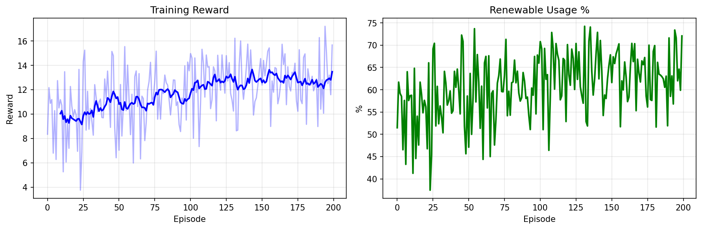
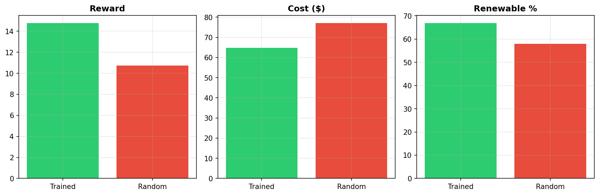
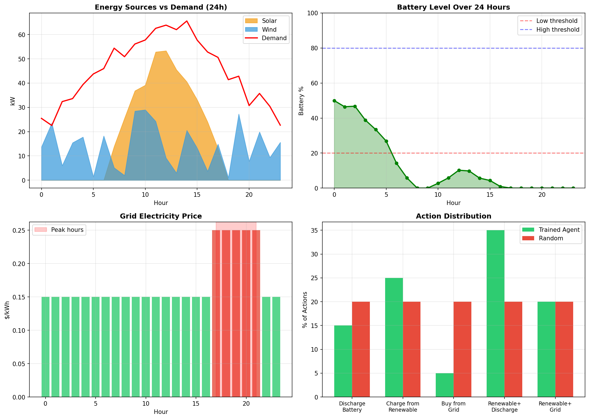

# 🔋 Microgrid Energy Optimization using Deep Reinforcement Learning

## Tối Ưu Hóa Năng Lượng Microgrid Sử Dụng Deep Reinforcement Learning (DQN & PPO)

### 📁 Files

| File | Mô Tả | Đối Tượng |
|------|-------|-----------|
| **`Microgrid_DQN_Simple.ipynb`** | ⭐ DQN đơn giản, CHỈ 3 BƯỚC | Người mới bắt đầu |
| **`Microgrid_PPO_Simple.ipynb`** | ⭐ PPO đơn giản, CHỈ 3 BƯỚC | Người mới bắt đầu |
| `Microgrid_DQN_Colab.py` | DQN phiên bản đầy đủ, chi tiết | Sinh viên nâng cao |
| `Microgrid_PPO_Colab.py` | PPO phiên bản đầy đủ, chi tiết | Sinh viên nâng cao |
| `REPORT_DQN.md` | Báo cáo chi tiết phương pháp DQN | Tất cả |
| `REPORT_PPO.md` | Báo cáo chi tiết phương pháp PPO | Tất cả |
| `REPORT.md` | Báo cáo tổng hợp đồ án | Tất cả |

---

## 🔀 SO SÁNH DQN vs PPO — Hai Phương Pháp RL Khác Nhau

### Tổng Quan

Dự án này triển khai **hai nhóm thuật toán RL** cho cùng bài toán microgrid:

| | **DQN** (Deep Q-Network) | **PPO** (Proximal Policy Optimization) |
|---|---|---|
| **Nhóm** | Value-based | Policy-based (Actor-Critic) |
| **Paper** | Mnih et al., 2015 (Nature) | Schulman et al., 2017 (OpenAI) |
| **Ý tưởng** | Học giá trị Q(s,a) → chọn action có Q cao nhất | Học trực tiếp policy π(a\|s) → sample action từ distribution |

### Kiến Trúc Mạng

```
DQN:    State(8) → [256→256→128] → Q-values(5)      ← 1 head, output Q cho mỗi action
PPO:    State(8) → [128→128] → Actor: π(a|s)(5)      ← 2 heads: policy + value
                             → Critic: V(s)(1)
```

| Đặc điểm | DQN | PPO |
|-----------|-----|-----|
| **Output** | Q(s, a₀)...Q(s, a₄) | π(a\|s) + V(s) |
| **Activation** | ReLU | Tanh |
| **Initialization** | Xavier | Orthogonal |
| **Regularization** | Dropout 0.1 | Entropy bonus |

### Cách Chọn Action

```
DQN (ε-greedy):                    PPO (stochastic policy):
┌──────────────────────┐           ┌──────────────────────┐
│ if random() < ε:     │           │ probs = Actor(state) │
│   action = random()  │           │ action = sample(probs)│
│ else:                │           │                      │
│   action = argmax Q  │           │ → TỰ NHIÊN explore   │
│                      │           │   (entropy cao =     │
│ → CẦN ε-greedy      │           │    đa dạng action)   │
│   để explore         │           │                      │
└──────────────────────┘           └──────────────────────┘
```

### Cách Training

```
DQN (Off-policy):                  PPO (On-policy):
┌──────────────────────┐           ┌──────────────────────┐
│ 1. Tương tác env     │           │ 1. Thu thập rollout  │
│ 2. Lưu replay buffer │           │    (nhiều episodes)  │
│ 3. Random sample     │           │ 2. Tính GAE advantage│
│    batch (64)        │           │ 3. Clipped update    │
│ 4. MSE loss cập nhật │           │    (10 epochs)       │
│ 5. Sync target net   │           │ 4. Clear buffer      │
│    (mỗi 1000 steps)  │           │    (dùng 1 lần!)     │
│                      │           │                      │
│ Update: MỖI STEP     │           │ Update: MỖI 4 EP     │
│ Data: TÁI SỬ DỤNG   │           │ Data: DÙNG 1 LẦN     │
└──────────────────────┘           └──────────────────────┘
```

### Stability Trick

| Vấn đề | DQN | PPO |
|--------|-----|-----|
| **Moving target** | Target Network (copy mỗi 1000 steps) | — |
| **Policy collapse** | — | Clipped objective (ratio ∈ [0.8, 1.2]) |
| **Gradient explosion** | Gradient clipping | Gradient clipping |
| **Overestimation** | Double DQN | Không có vấn đề này |

### Công Thức Chính

```
DQN Loss:   L = (Q(s,a) - [r + γ × max Q_target(s',a')])²

PPO Loss:   L = -min(ratio × A, clip(ratio, 1-ε, 1+ε) × A)
            + 0.5 × MSE(V_pred, V_target)
            - 0.01 × Entropy(π)

            ratio = π_new(a|s) / π_old(a|s)
            A = GAE advantage
```

### Khi Nào Dùng Cái Nào?

| Tình huống | Chọn | Lý do |
|------------|------|-------|
| Action rời rạc, ít action | **DQN** | DQN tối ưu cho discrete |
| Cần sample efficient | **DQN** | Replay buffer tái sử dụng data |
| Muốn đơn giản, dễ debug | **DQN** | Ít hyperparameters hơn |
| Muốn policy smooth | **PPO** | Xác suất thay đổi mượt mà |
| Có thể mở rộng continuous | **PPO** | Dễ scale sang continuous action |
| Cần robust, ít tuning | **PPO** | Clipped objective tự ổn định |

---

## 📊 Kết Quả Training

### Performance Metrics

| Metric | Trained Agent | Random Baseline | Improvement |
|--------|---------------|-----------------|-------------|
| **Mean Episode Reward** | +14.77 | +10.72 | **+37.8%** |
| **Mean Daily Cost** | $64.78 | $77.02 | **-15.9%** |
| **Renewable Usage Ratio** | 66.9% | 58.0% | +8.9% |

### 🎯 Random Baseline là gì?

**Random Baseline** là một agent **không học gì cả**, chỉ đơn giản chọn hành động ngẫu nhiên ở mỗi bước:

```python
def select_action(self, state):
    return random.randint(0, 4)  # Ngẫu nhiên 1 trong 5 hành động
```

**Tại sao dùng Random Baseline?**

- Đánh giá hiệu quả học: Xem agent có thực sự "học" được không
- Đo lường cải thiện: Tính % improvement so với baseline
- Tiêu chuẩn cơ bản: Bất kỳ thuật toán nào cũng phải tốt hơn random

**Random agent** chọn hành động không theo logic → thường xả pin khi giá điện thấp (lãng phí), mua điện lưới khi giá cao (tốn tiền).

**Trained DQN agent** đã học được → sạc pin khi năng lượng tái tạo dồi dào, xả pin khi giá điện cao, tối đa hóa dùng solar/wind.

### Training Curves



### Agent vs Random Comparison



### 24-Hour Episode Analysis



### Key Conclusions

✅ **DQN agent đã học thành công chính sách phân phối năng lượng:**

- Tối đa hóa sử dụng nguồn năng lượng tái tạo (66.9%)
- Giảm chi phí mua điện từ lưới tới 15.9%
- Cải thiện reward so với random baseline: +37.8%
- Duy trì mức pin hợp lý cho giờ cao điểm

---

## ⚖️ Ethical, Practical & Future Considerations

### 1. Vấn Đề Đạo Đức (Ethical Concerns)

| Vấn đề | Mô tả | Giải pháp đề xuất |
|--------|-------|-------------------|
| **Công bằng năng lượng** | AI có thể ưu tiên tối ưu chi phí thay vì đảm bảo điện cho tất cả | Thêm constraint đảm bảo demand satisfaction tối thiểu |
| **Transparency** | Black-box decision làm người dùng khó hiểu | Explainable AI (XAI), visualization của policy |
| **Bias trong data** | Model trained trên data mùa hè có thể fail vào mùa đông | Đa dạng hóa training data, continuous learning |
| **Privacy** | Thu thập dữ liệu tiêu thụ có thể xâm phạm quyền riêng tư | Federated Learning, data anonymization |

### 2. Thách Thức Triển Khai Thực Tế (Practical Deployment)

**Challenges:**

- 🔧 **Hardware**: Cần edge device đủ mạnh để chạy inference real-time
- 📡 **Connectivity**: Mất kết nối internet → cần fallback policy
- 🔋 **Battery degradation**: Model cần cập nhật khi pin xuống cấp
- ⚡ **Safety**: Cần mechanism override manual khi AI quyết định sai
- 📊 **Monitoring**: Cần dashboard giám sát hiệu suất Agent

**Recommendations:**

```
1. Hybrid approach: RL + Rule-based fallback
2. Edge deployment với periodic cloud sync
3. Human-in-the-loop cho critical decisions
4. A/B testing trước khi full deployment
```

### 3. Hướng Phát Triển Tương Lai (Future Enhancements)

| Cải tiến | Mô tả | Lợi ích tiềm năng |
|----------|-------|-------------------|
| **Multi-Agent RL** | Nhiều agent quản lý các zone khác nhau | Scalable cho grid lớn |
| **PPO/A2C** ✅ | Thuật toán Policy Gradient thay DQN | Đã triển khai trong project |
| **Continuous Actions** | Dùng DDPG/SAC cho action liên tục | Điều khiển chính xác hơn |
| **Demand Forecasting** | Kết hợp LSTM dự đoán demand | Proactive planning |
| **Multi-objective RL** | Tối ưu đồng thời cost, reliability, emissions | Cân bằng nhiều mục tiêu |
| **Transfer Learning** | Train 1 lần, deploy nhiều microgrid | Giảm thời gian training |
| **Digital Twin** | Mô phỏng trước khi deploy thật | An toàn, test edge cases |

### 4. Kết Luận Tổng Quan

> Dự án đã chứng minh **Deep Reinforcement Learning (DQN)** có thể:
>
> - ✅ Học được chính sách tối ưu phân phối năng lượng
> - ✅ Cải thiện **+37.8%** reward so với random baseline
> - ✅ Giảm **15.9%** chi phí mua điện từ lưới
> - ✅ Đạt **66.9%** tỷ lệ sử dụng năng lượng tái tạo
>
> Tuy nhiên, việc triển khai thực tế cần xem xét đầy đủ các yếu tố đạo đức, an toàn và khả năng mở rộng của hệ thống.

---

## 📈 Data Generation (Simulated Environment)

Theo yêu cầu đề bài, dữ liệu được **mô phỏng ngẫu nhiên theo mô hình xác suất**, không sử dụng dataset từ nguồn bên ngoài:

| Thành phần | Công thức mô phỏng | Ý nghĩa |
|------------|---------------------|---------|
| **Solar** | `sin((hour-6) × π/12) × 50 × random(0.8, 1.2)` | Cao nhất lúc 12h, có nhiễu |
| **Wind** | `30 × random()` | Hoàn toàn ngẫu nhiên 0-30 kW |
| **Demand** | `40 + 20 × sin((hour-6) × π/12) + random(0, 10)` | Cao nhất buổi chiều, có nhiễu |
| **Price** | `0.15 + 0.1 × (17≤hour≤21)` | Giá cao giờ cao điểm 17h-21h |

```python
# Ví dụ code sinh dữ liệu
solar = max(0, np.sin((hour - 6) * np.pi / 12)) * 50 * (0.8 + 0.4 * np.random.random())
wind = 30 * np.random.random()
demand = 40 + 20 * np.sin((hour - 6) * np.pi / 12) + 10 * np.random.random()
```

> **Lưu ý:** Đây là **Stochastic Simulation** theo đúng yêu cầu của đề bài, không phải dataset thực tế.

---

## 🧠 Deep Learning & Reinforcement Learning Pipeline

### Pipeline Tổng Quan

```
┌─────────────────────────────────────────────────────────────────┐
│                    MICROGRID RL PIPELINE                        │
├─────────────────────────────────────────────────────────────────┤
│  ┌─────────────┐    ┌─────────────┐    ┌─────────────┐         │
│  │ ENVIRONMENT │ →  │ RL AGENT    │ →  │ NEURAL NET  │         │
│  │ (Microgrid) │    │ (Decision)  │    │ (DQN)       │         │
│  └─────────────┘    └─────────────┘    └─────────────┘         │
│        ↓                   ↓                  ↓                 │
│   State (8D)         Action (5)         Q-values               │
└─────────────────────────────────────────────────────────────────┘
```

### RL Ở Giai Đoạn Nào? Tác Động Ra Sao?

| Giai Đoạn | Công Nghệ | Vai Trò | Tác Động |
|-----------|-----------|---------|----------|
| **Perception** | State Vector | Thu thập 8 features từ môi trường | Hiểu tình huống hiện tại |
| **Decision** | **RL Agent** | Chọn 1 trong 5 hành động | Ra quyết định thông minh |
| **Learning** | **Deep Learning** | Neural network học Q-function | Cải thiện theo thời gian |
| **Action** | Environment | Thực thi hành động, nhận reward | Thay đổi trạng thái hệ thống |

### DQN (Deep Q-Network) Là Gì?

**DQN = Q-Learning + Deep Neural Network**

- **Q-Learning**: Thuật toán RL học giá trị của mỗi hành động
- **Deep Neural Network**: Xấp xỉ Q-function cho state space liên tục

```
DQN Architecture:
   State (8D)  ──►  [256 → 256 → 128]  ──►  Q-values (5 actions)
                     ReLU    ReLU   ReLU
   
   Q(s,a) = Expected cumulative reward nếu chọn action a ở state s
   Agent chọn: a* = argmax Q(s,a)  (action có Q-value cao nhất)
```

### Vòng Lặp Training

```
Repeat for each episode:
   1. Observe state s (battery, demand, solar, wind, price, time)
   2. ε-greedy selection:
      - Random action (với xác suất ε) → Exploration
      - argmax Q(s,a) (với xác suất 1-ε) → Exploitation
   3. Execute action a → receive reward r, observe s'
   4. Store (s, a, r, s', done) in Replay Buffer
   5. Sample random batch from buffer
   6. Compute target: y = r + γ × max Q(s',a')  [Bellman equation]
   7. Update network: minimize loss = (Q(s,a) - y)²
   8. Repeat until episode ends (24 hours simulated)
```

### Tại Sao Dùng DQN Thay Vì Q-Learning Thông Thường?

| Q-Learning | DQN |
|------------|-----|
| Bảng Q-table | Neural Network |
| State rời rạc | State liên tục (8D) |
| Không scale | Scale được với state phức tạp |
| Không generalize | Generalize cho state chưa gặp |

---

# 📘 HƯỚNG DẪN CHI TIẾT ĐỀ BÀI

---

## 📋 Mục Lục

1. [Tổng Quan Đề Bài](#1-tổng-quan-đề-bài)
2. [Bối Cảnh Bài Toán](#2-bối-cảnh-bài-toán)
3. [Phần 1: Mô Tả Bài Toán (15%)](#3-phần-1-mô-tả-bài-toán-15)
4. [Phần 2: Mô Hình Hóa MDP (20%)](#4-phần-2-mô-hình-hóa-mdp-20)
5. [Phần 3: Thuật Toán RL (25%)](#5-phần-3-thuật-toán-rl-25)
6. [Phần 4: Phân Tích Tối Ưu Hóa (15%)](#6-phần-4-phân-tích-tối-ưu-hóa-15)
7. [Phần 5: Kết Quả & Đánh Giá (15%)](#7-phần-5-kết-quả--đánh-giá-15)
8. [Phần 6: Đạo Đức & Tương Lai (10%)](#8-phần-6-đạo-đức--tương-lai-10)
9. [Yêu Cầu Kỹ Thuật](#9-yêu-cầu-kỹ-thuật)
10. [Lưu Ý & Tài Liệu Tham Khảo](#10-lưu-ý--tài-liệu-tham-khảo)

---

## 1. Tổng Quan Đề Bài

### 🎯 Mục Tiêu Chính

Xây dựng một **tác tử Deep Reinforcement Learning (DQN hoặc Policy Gradient)** để tối ưu hóa việc phân phối năng lượng trong hệ thống microgrid.

### 📌 Bài Toán Cần Giải Quyết

Phân phối năng lượng trong microgrid là bài toán tối ưu hóa phức tạp bao gồm:

- Nhu cầu năng lượng động (thay đổi theo thời gian)
- Nguồn năng lượng tái tạo biến thiên (mặt trời, gió)
- Ràng buộc về lưu trữ (dung lượng pin hữu hạn)
- Tối thiểu hóa chi phí

### 🏆 Ba Mục Tiêu Tối Ưu Chính

1. **Tiết kiệm chi phí**: Giảm thiểu chi phí mua điện từ lưới chính
2. **Độ tin cậy**: Đảm bảo luôn đáp ứng đủ nhu cầu tiêu thụ điện
3. **Năng lượng xanh**: Tối đa hóa việc sử dụng năng lượng mặt trời và gió

### 📊 Kỹ Năng Được Đánh Giá

- Mô hình hóa bài toán thực tế thành Markov Decision Process (MDP)
- Cài đặt thuật toán RL tiên tiến
- Phân tích hiệu suất tối ưu hóa và các hạn chế
- Đánh giá phê phán về triển khai, đạo đức và cải tiến tương lai

---

## 2. Bối Cảnh Bài Toán

### 🔋 Hệ Thống Microgrid Là Gì?

**Microgrid** là một mạng lưới điện quy mô nhỏ, cục bộ, tích hợp:

- Các nguồn năng lượng phân tán
- Hệ thống lưu trữ
- Tải điện có thể điều khiển

Microgrid có thể hoạt động **kết nối với lưới điện chính** hoặc **độc lập**.

### 🏗️ Các Thành Phần Của Hệ Thống

```
┌─────────────────────────────────────────────────────────────────────────┐
│                         HỆ THỐNG MICROGRID                              │
│                                                                         │
│   ☀️ NĂNG LƯỢNG       🌬️ NĂNG LƯỢNG       🔋 PIN LƯU        ⚡ LƯỚI    │
│      MẶT TRỜI            GIÓ               TRỮ              ĐIỆN       │
│   ┌──────┐           ┌──────┐           ┌──────┐         ┌──────┐      │
│   │  PV  │           │ Wind │           │ BESS │         │Utility│     │
│   │Panels│           │Turbine│          │100kWh│         │ Grid │      │
│   └──┬───┘           └──┬───┘           └──┬───┘         └──┬───┘      │
│      │                  │                   │                │          │
│      └──────────────────┴─────────┬─────────┴────────────────┘          │
│                                   │                                     │
│                          ┌────────┴────────┐                            │
│                          │   HỆ THỐNG      │                            │
│                          │  QUẢN LÝ        │  ◄── 🤖 DQN Agent         │
│                          │  NĂNG LƯỢNG     │                            │
│                          └────────┬────────┘                            │
│                                   │                                     │
│                     ┌─────────────┴─────────────┐                       │
│                     │                           │                       │
│               🏠 Tải Hộ               🏭 Tải Công                       │
│                 Gia Đình                  Nghiệp                        │
└─────────────────────────────────────────────────────────────────────────┘
```

| Thành phần | Mô tả chi tiết |
|------------|----------------|
| **Pin mặt trời (Solar PV)** | Phát điện từ ánh sáng mặt trời, sản lượng cao nhất vào buổi trưa, không hoạt động ban đêm |
| **Turbine gió (Wind)** | Phát điện từ gió, sản lượng phụ thuộc vào tốc độ gió, có thể hoạt động cả ngày lẫn đêm |
| **Pin lưu trữ (BESS)** | Battery Energy Storage System, dung lượng 100kWh, lưu năng lượng dư thừa để dùng khi cần |
| **Lưới điện (Utility Grid)** | Nguồn điện dự phòng, có thể mua khi thiếu điện, giá biến động theo giờ |
| **Tải tiêu thụ** | Nhu cầu điện của hộ gia đình và công nghiệp, thay đổi theo thời gian trong ngày |

### ❓ Tại Sao Là Bài Toán Ra Quyết Định Tuần Tự?

#### Đặc điểm 1: Liên Kết Thời Gian (Temporal Coupling)

- Trạng thái pin tại thời điểm **t+1** phụ thuộc vào hành động tại thời điểm **t**
- Ví dụ: Nếu sạc pin lúc 12h trưa → pin đầy lúc 6h tối để dùng

#### Đặc điểm 2: Hậu Quả Trì Hoãn (Delayed Consequences)

- Tác động của quyết định có thể không thấy ngay lập tức
- Ví dụ: Xả pin hết lúc 5h chiều → không có pin dùng lúc 7h tối giá cao

#### Đặc điểm 3: Đánh Đổi Ngắn Hạn vs Dài Hạn

- Tối đa hóa lợi ích ngay có thể ảnh hưởng xấu đến hiệu suất tương lai
- Ví dụ: Bán điện lúc trưa (giá trung bình) vs giữ lại dùng lúc tối (giá cao)

### 🔄 Hạn Chế Của Phương Pháp Truyền Thống

| Phương pháp | Cách hoạt động | Hạn chế chi tiết |
|-------------|----------------|------------------|
| **Rule-based** | Quy tắc if-then cố định | Không thể thích ứng với thay đổi; bỏ lỡ cơ hội tối ưu |
| **Linear Programming** | Tối ưu hóa toán học | Cần dự báo hoàn hảo về tương lai; giả định quan hệ tuyến tính không thực tế |
| **Model Predictive Control** | Tối ưu hóa theo horizon cuộn | Chi phí tính toán rất cao; cần mô hình chính xác của hệ thống |
| **Heuristics (GA, PSO)** | Thuật toán di truyền, bầy đàn | Không đảm bảo tìm được lời giải tối ưu toàn cục; phụ thuộc bài toán cụ thể |

### ✅ Ưu Điểm Của Reinforcement Learning

1. **Học không cần mô hình (Model-free)**: Không cần mô hình toán học tường minh của hệ thống
2. **Thích ứng liên tục**: Tự động điều chỉnh theo điều kiện thay đổi
3. **Tối ưu dài hạn**: Tự nhiên cân bằng giữa phần thưởng ngay và tương lai
4. **Xử lý bất định**: Phát triển chính sách robust với nhiều kịch bản

---

## 3. Phần 1: Mô Tả Bài Toán (15%)

### 📝 Yêu Cầu Chi Tiết

Phần này yêu cầu bạn **giải thích** hệ thống microgrid và **lập luận** tại sao Reinforcement Learning phù hợp hơn các phương pháp khác.

### 📦 Sản Phẩm Cần Nộp

1. **Giải thích hệ thống Microgrid**
2. **Lý do phân phối năng lượng là bài toán ra quyết định tuần tự**
3. **Hạn chế của phương pháp tối ưu thông thường**
4. **Ý nghĩa thực tiễn và tác động**

### 📖 Hướng Dẫn Viết Chi Tiết

#### 3.1 Giới Thiệu Hệ Thống Microgrid

**Nội dung cần viết:**

- Định nghĩa microgrid là gì
- Sự khác biệt với hệ thống điện tập trung truyền thống
- Ưu điểm: độ tin cậy cao, giảm tổn thất truyền tải, tích hợp năng lượng tái tạo tốt hơn

**Mô tả từng thành phần:**

```markdown
1. NGUỒN NĂNG LƯỢNG TÁI TẠO
   - Pin mặt trời: Sản lượng thay đổi theo thời tiết và thời gian trong ngày
   - Turbine gió: Sản lượng phụ thuộc vào tốc độ gió, có thể dự đoán một phần

2. HỆ THỐNG LƯU TRỮ NĂNG LƯỢNG (BESS)
   - Dung lượng hữu hạn (100kWh trong đề bài)
   - Lưu năng lượng dư thừa khi phát nhiều
   - Giải phóng năng lượng khi nhu cầu cao hoặc phát ít

3. KẾT NỐI LƯỚI ĐIỆN
   - Mua điện khi nguồn tái tạo và pin không đủ
   - Giá điện biến động theo thời gian (peak/off-peak)

4. TẢI TIÊU THỤ
   - Nhu cầu điện tổng hợp từ nhiều hộ gia đình và doanh nghiệp
   - Có pattern theo thời gian trong ngày (cao điểm sáng, trưa, tối)
```

#### 3.2 Tại Sao Là Bài Toán Ra Quyết Định Tuần Tự

**Ví dụ minh họa:**
> Lúc 12h trưa, pin đầy và năng lượng mặt trời đang ở đỉnh. Người vận hành phải quyết định:
>
> - Bán điện dư cho lưới với giá hiện tại?
> - Hay giữ lại để dùng vào buổi tối khi giá cao hơn?
>
> Quyết định này phụ thuộc không chỉ vào điều kiện hiện tại mà còn dự đoán về nhu cầu tương lai, sản lượng phát điện, và giá điện.

**Ba đặc điểm cần giải thích:**

1. Liên kết thời gian
2. Hậu quả trì hoãn
3. Trade-off ngắn hạn và dài hạn

#### 3.3 Hạn Chế Của Phương Pháp Truyền Thống

**Bảng so sánh chi tiết:**

| Phương pháp | Mô tả | Ưu điểm | Hạn chế |
|-------------|-------|---------|---------|
| Rule-based | Quy tắc if-then cố định | Đơn giản, dễ hiểu | Không thích ứng, bỏ lỡ cơ hội |
| Linear Programming | Tối ưu hóa toán học | Có lý thuyết chứng minh | Cần dự báo hoàn hảo, giả định tuyến tính |
| MPC | Tối ưu theo horizon cuộn | Xử lý ràng buộc tốt | Chi phí tính toán cao, cần mô hình chính xác |
| GA/PSO | Tìm kiếm heuristic | Xử lý không gian phức tạp | Không đảm bảo tối ưu, chậm hội tụ |

#### 3.4 Ý Nghĩa Thực Tiễn

**Các điểm cần đề cập:**

- Giảm carbon footprint bằng việc tối đa hóa năng lượng tái tạo
- Tiết kiệm chi phí điện cho hộ gia đình và doanh nghiệp
- Tăng độ ổn định lưới điện
- Hỗ trợ chuyển đổi năng lượng xanh

---

## 4. Phần 2: Mô Hình Hóa MDP (20%)

### 📝 Yêu Cầu Chi Tiết

Chuyển đổi bài toán microgrid thành **Markov Decision Process** formal với đầy đủ các thành phần.

### 📦 Sản Phẩm Cần Nộp

1. **Sơ đồ MDP** (diagram)
2. **Giải thích chi tiết**: States, Actions, Rewards, Transitions
3. **Lý giải** cho các lựa chọn thiết kế

### 🔲 MDP Framework

MDP được định nghĩa bởi tuple **(S, A, P, R, γ)**:

- **S**: Không gian trạng thái (State space)
- **A**: Không gian hành động (Action space)
- **P**: Hàm chuyển đổi (Transition function)
- **R**: Hàm phần thưởng (Reward function)
- **γ**: Hệ số chiết khấu (Discount factor)

### 📊 Không Gian Trạng Thái (State Space) - 8 Chiều

| # | Tên biến | Phạm vi | Ý nghĩa | Lý do đưa vào |
|---|----------|---------|---------|---------------|
| 1 | `battery_level` | [0, 1] | Mức năng lượng pin đã chuẩn hóa (0=trống, 1=đầy) | Quyết định có thể sạc/xả không |
| 2 | `demand` | [0, 1] | Nhu cầu tiêu thụ điện hiện tại | Biết cần bao nhiêu điện để đáp ứng |
| 3 | `solar_generation` | [0, 1] | Công suất phát từ pin mặt trời | Biết có bao nhiêu điện miễn phí |
| 4 | `wind_generation` | [0, 1] | Công suất phát từ turbine gió | Biết có bao nhiêu điện miễn phí |
| 5 | `grid_price` | [0, 1] | Giá điện lưới hiện tại (chuẩn hóa) | Quyết định có nên mua từ lưới |
| 6 | `hour_sin` | [-1, 1] | sin(2π × hour / 24) | Mã hóa thời gian tuần hoàn |
| 7 | `hour_cos` | [-1, 1] | cos(2π × hour / 24) | Mã hóa thời gian tuần hoàn |
| 8 | `prev_action` | [0, 1] | Hành động ở bước trước (chuẩn hóa) | Tạo tính nhất quán trong chính sách |

#### 💡 Giải Thích Mã Hóa Thời Gian Tuần Hoàn

**Vấn đề:** Nếu dùng hour = 0, 1, 2, ..., 23 trực tiếp:

- Model nghĩ 23h và 0h rất xa nhau (khoảng cách = 23)
- Nhưng thực tế chúng chỉ cách nhau 1 giờ!

**Giải pháp:** Sử dụng mã hóa sin/cos:

```python
hour_sin = sin(2π × hour / 24)
hour_cos = cos(2π × hour / 24)
```

**Ví dụ:**

- 0h: sin=0, cos=1
- 6h: sin=1, cos=0
- 12h: sin=0, cos=-1
- 18h: sin=-1, cos=0
- 23h: sin≈0, cos≈1 (gần với 0h!)

### 🎮 Không Gian Hành Động (Action Space) - 5 Hành Động Rời Rạc

| Hành động | Tên | Mô tả chi tiết | Khi nào nên dùng |
|-----------|-----|----------------|------------------|
| **0** | Xả pin (Discharge) | Dùng năng lượng trong pin để đáp ứng nhu cầu | Giá điện lưới cao, pin còn đủ |
| **1** | Sạc từ năng lượng tái tạo | Lưu năng lượng dư thừa vào pin | Năng lượng tái tạo > nhu cầu, pin chưa đầy |
| **2** | Mua từ lưới | Mua toàn bộ điện cần thiết từ lưới | Không đủ năng lượng tái tạo và pin trống |
| **3** | Tái tạo + Xả pin | Ưu tiên dùng năng lượng tái tạo, thiếu thì bổ sung từ pin | Có năng lượng tái tạo nhưng không đủ |
| **4** | Tái tạo + Lưới | Ưu tiên dùng năng lượng tái tạo, thiếu thì mua từ lưới | Pin thấp, cần tiết kiệm pin cho peak |

**Tại sao dùng action rời rạc thay vì liên tục?**

- DQN hoạt động tốt nhất với action rời rạc
- Dễ học và hội tụ hơn
- Phù hợp với quyết định thực tế (chọn chế độ vận hành)

### 🏅 Hàm Phần Thưởng (Reward Function)

```
R(s, a, s') = R_renewable + R_grid + R_unmet + R_battery + R_bonus
```

#### Chi Tiết Từng Thành Phần

| Thành phần | Công thức | Giải thích | Tác dụng |
|------------|-----------|------------|----------|
| **R_renewable** | +1.0 × (renewable_used / base_demand) | Thưởng khi dùng năng lượng tái tạo | Khuyến khích năng lượng sạch |
| **R_grid** | −2.0 × (grid_purchased / base_demand) × price | Phạt khi mua từ lưới, nhân với giá | Giảm chi phí điện |
| **R_unmet** | −5.0 × (unmet_demand / base_demand) | Phạt nặng khi không đủ điện | Đảm bảo độ tin cậy |
| **R_battery** | −0.1 × (charge + discharge) | Phạt nhẹ cho mỗi lần sạc/xả | Mô hình hao mòn pin |
| **R_bonus** | +0.5 nếu không dùng lưới trong giờ cao điểm | Thưởng khi tránh được peak hours | Tối ưu thời điểm chiến lược |

#### 🎯 Thiết Kế Reward Function

**Nguyên tắc:**

1. **Thưởng > 0** cho hành vi mong muốn (dùng năng lượng tái tạo)
2. **Phạt < 0** cho hành vi không mong muốn (mua từ lưới, thiếu điện)
3. **Trọng số** phản ánh mức độ quan trọng (thiếu điện phạt nặng nhất: -5.0)
4. **Chuẩn hóa** theo base_demand để reward ổn định

### 🔄 Động Lực Chuyển Đổi (Transition Dynamics)

```python
# Cập nhật trạng thái pin
new_battery = old_battery + charge_amount - discharge_amount
new_battery = clip(new_battery, 0, max_capacity)  # Ràng buộc vật lý

# Sinh năng lượng tái tạo (stochastic)
solar_gen = solar_pattern(hour) + random_noise()
wind_gen = wind_pattern(hour) + random_noise()

# Nhu cầu tiêu thụ (probabilistic)
demand = base_demand(hour) + random_variation()
```

**Đặc điểm:**

- **Deterministic**: Cập nhật pin theo công thức vật lý
- **Stochastic**: Năng lượng tái tạo có nhiễu (thời tiết)
- **Probabilistic**: Nhu cầu có biến động ngẫu nhiên

### 🛑 Điều Kiện Kết Thúc Episode

| Điều kiện | Mô tả | Reward khi kết thúc |
|-----------|-------|---------------------|
| Hết ngày/tuần | Hoàn thành horizon thời gian | Tổng reward tích lũy |
| Pin gặp sự cố | Battery level = 0 và demand > supply | Phạt nặng |
| Vượt ngưỡng unmet | Quá nhiều lần không đáp ứng được nhu cầu | Phạt nặng |

---

## 5. Phần 3: Thuật Toán RL (25%)

### 📝 Yêu Cầu Chi Tiết

Chọn và cài đặt thuật toán RL phù hợp với bài toán.

### 📦 Sản Phẩm Cần Nộp

1. **Lựa chọn thuật toán** với lý giải
2. **Code Python** sử dụng PyTorch hoặc TensorFlow, có comment đầy đủ
3. **Giải thích kiến trúc mạng** và hyperparameters

### 🤖 So Sánh Các Thuật Toán RL

| Thuật toán | Ưu điểm | Nhược điểm | Phù hợp |
|------------|---------|------------|---------|
| **Tabular Q-Learning** | Đơn giản, đảm bảo hội tụ | Không xử lý được state liên tục | ❌ |
| **DQN** | Xử lý state liên tục, sample efficient | Chỉ với action rời rạc | ✅ Rất phù hợp |
| **Policy Gradient** | Xử lý action liên tục | Variance cao, sample inefficient | ⚠️ Có thể dùng |
| **Actor-Critic** | Variance thấp hơn PG | Phức tạp hơn cần thiết | ⚠️ Overcomplicated |

**Khuyến nghị: Double DQN** - Giải quyết vấn đề overestimation của DQN gốc.

### 🧠 Kiến Trúc Neural Network

```
┌─────────────────────────────────────────┐
│         INPUT LAYER (8 neurons)         │
│    [battery, demand, solar, wind,       │
│     price, hour_sin, hour_cos, prev]    │
└─────────────────────┬───────────────────┘
                      ↓
┌─────────────────────────────────────────┐
│   HIDDEN LAYER 1: 256 neurons           │
│   Activation: ReLU                      │
│   Dropout: 0.1 (regularization)         │
└─────────────────────┬───────────────────┘
                      ↓
┌─────────────────────────────────────────┐
│   HIDDEN LAYER 2: 256 neurons           │
│   Activation: ReLU                      │
│   Dropout: 0.1                          │
└─────────────────────┬───────────────────┘
                      ↓
┌─────────────────────────────────────────┐
│   HIDDEN LAYER 3: 128 neurons           │
│   Activation: ReLU                      │
└─────────────────────┬───────────────────┘
                      ↓
┌─────────────────────────────────────────┐
│        OUTPUT LAYER (5 neurons)         │
│   Q(s, a₀), Q(s, a₁), Q(s, a₂),        │
│   Q(s, a₃), Q(s, a₄)                   │
└─────────────────────────────────────────┘

Tổng tham số: ~104,000
Khởi tạo: Xavier/Glorot
```

### 🔧 Các Thành Phần Quan Trọng Của DQN

#### 1. Experience Replay Buffer

```python
class ReplayBuffer:
    """
    Lưu trữ các transition (s, a, r, s', done) để train offline.
    
    Lợi ích:
    - Phá vỡ tương quan thời gian giữa các samples
    - Tái sử dụng kinh nghiệm nhiều lần
    - Ổn định quá trình học
    """
    def __init__(self, capacity=100000):
        self.buffer = deque(maxlen=capacity)
    
    def push(self, state, action, reward, next_state, done):
        self.buffer.append((state, action, reward, next_state, done))
    
    def sample(self, batch_size=64):
        # Random sampling để phá correlation
        return random.sample(self.buffer, batch_size)
```

#### 2. Target Network

```python
class DQNAgent:
    def __init__(self):
        self.q_network = QNetwork()        # Mạng chính, update liên tục
        self.target_network = QNetwork()   # Mạng target, update chậm
        
    def update_target(self):
        """Copy weights từ q_network sang target_network mỗi 1000 steps"""
        self.target_network.load_state_dict(self.q_network.state_dict())
```

**Tại sao cần Target Network?**

- Q-learning update: Q(s,a) ← r + γ × max Q(s', a')
- Nếu dùng cùng 1 network để tính cả 2 vế → "moving target" → không ổn định
- Target network cung cấp target ổn định trong 1000 steps

#### 3. Epsilon-Greedy Exploration

```python
def select_action(self, state, epsilon):
    if random.random() < epsilon:
        return random.randint(0, 4)  # Exploration: random action
    else:
        with torch.no_grad():
            q_values = self.q_network(state)
            return q_values.argmax().item()  # Exploitation: best action

# Epsilon decay schedule
epsilon_start = 1.0    # Ban đầu: 100% random
epsilon_end = 0.01     # Cuối: 1% random
epsilon_decay = 0.995  # Giảm 0.5% mỗi episode
```

### ⚙️ Hyperparameters Chi Tiết

| Tham số | Giá trị | Giải thích chi tiết |
|---------|---------|---------------------|
| **Learning rate (α)** | 1×10⁻⁴ | Nhỏ để hội tụ ổn định với state liên tục |
| **Discount factor (γ)** | 0.99 | Cao (gần 1) vì cần planning dài hạn (24h+) |
| **Batch size** | 64 | Đủ lớn để giảm variance, đủ nhỏ để train nhanh |
| **Buffer size** | 100,000 | Lưu ~4,000 episodes kinh nghiệm |
| **Target update** | 1,000 steps | Update đủ thường xuyên nhưng không quá nhanh |
| **Gradient clipping** | max_norm=10 | Ngăn exploding gradients |
| **Optimizer** | Adam | Tốt cho deep learning, adaptive learning rate |
| **Hidden layers** | [256, 256, 128] | Đủ capacity cho bài toán 8D state |

### 💻 Code Template

```python
import torch
import torch.nn as nn
import torch.optim as optim

class QNetwork(nn.Module):
    def __init__(self, state_dim=8, action_dim=5):
        super().__init__()
        self.layers = nn.Sequential(
            nn.Linear(state_dim, 256),
            nn.ReLU(),
            nn.Dropout(0.1),
            nn.Linear(256, 256),
            nn.ReLU(),
            nn.Dropout(0.1),
            nn.Linear(256, 128),
            nn.ReLU(),
            nn.Linear(128, action_dim)
        )
        self._init_weights()
    
    def _init_weights(self):
        for m in self.modules():
            if isinstance(m, nn.Linear):
                nn.init.xavier_uniform_(m.weight)
                nn.init.zeros_(m.bias)
    
    def forward(self, x):
        return self.layers(x)

class DQNAgent:
    def __init__(self, lr=1e-4, gamma=0.99):
        self.q_net = QNetwork()
        self.target_net = QNetwork()
        self.target_net.load_state_dict(self.q_net.state_dict())
        
        self.optimizer = optim.Adam(self.q_net.parameters(), lr=lr)
        self.gamma = gamma
        self.buffer = ReplayBuffer()
        
    def train_step(self, batch_size=64):
        if len(self.buffer) < batch_size:
            return
        
        states, actions, rewards, next_states, dones = self.buffer.sample(batch_size)
        
        # Current Q values
        current_q = self.q_net(states).gather(1, actions)
        
        # Double DQN: action selection từ q_net, evaluation từ target_net
        next_actions = self.q_net(next_states).argmax(1, keepdim=True)
        next_q = self.target_net(next_states).gather(1, next_actions)
        target_q = rewards + self.gamma * next_q * (1 - dones)
        
        # Loss và update
        loss = nn.MSELoss()(current_q, target_q.detach())
        self.optimizer.zero_grad()
        loss.backward()
        nn.utils.clip_grad_norm_(self.q_net.parameters(), max_norm=10)
        self.optimizer.step()
```

---

## 6. Phần 4: Phân Tích Tối Ưu Hóa (15%)

### 📝 Yêu Cầu Chi Tiết

Thảo luận về cách RL agent tối ưu hóa việc phân phối năng lượng. Phân tích xu hướng reward, hội tụ học, và hiệu quả chính sách.

### 📦 Sản Phẩm Cần Nộp

1. **Phân tích phê phán** về hiệu suất tối ưu hóa
2. **Đồ thị** thể hiện quá trình học
3. **Giải thích** các pattern hành vi đã học

### 📈 Mẫu Hành Vi Đã Học Theo Thời Gian

| Thời gian | Giờ | Hành vi Agent | Lý do chi tiết |
|-----------|-----|---------------|----------------|
| **Đêm khuya** | 0:00-6:00 | Tái tạo + Lưới | Giá điện thấp nhất trong ngày, nhu cầu thấp, bảo toàn pin cho peak |
| **Cao điểm sáng** | 7:00-9:00 | Tái tạo + Xả pin | Bắt đầu có mặt trời, nhu cầu tăng, tránh mua lưới giá cao |
| **Trưa** | 10:00-14:00 | Sạc pin | Năng lượng mặt trời đỉnh điểm, nhu cầu trung bình, tích trữ cho tối |
| **Chiều** | 15:00-17:00 | Hỗn hợp | Mặt trời giảm, chuẩn bị cho peak tối, duy trì mức pin |
| **Cao điểm tối** | 18:00-21:00 | Tái tạo + Xả pin | Giá điện cao nhất, nhu cầu cao nhất, tận dụng pin đã sạc |
| **Khuya** | 22:00-23:00 | Tái tạo + Xả pin | Dùng nốt pin còn lại, chuẩn bị cho ngày mới |

### 📊 Phân Tích Hội Tụ Huấn Luyện

**Ví dụ log huấn luyện:**

```
Episode   100 | Reward:  -1.94 | ε: 0.606 → Giai đoạn exploration
Episode   200 | Reward:  +7.89 | ε: 0.367 → Bắt đầu hội tụ
Episode   300 | Reward:  +8.39 | ε: 0.222 → Tinh chỉnh
Episode   400 | Reward: +12.17 | ε: 0.135 → Gần tối ưu
Episode   500 | Reward: +13.34 | ε: 0.082 → Đã hội tụ

Best Episode: 18.00 | Training Time: ~9 seconds
```

**Các đồ thị cần vẽ:**

1. **Reward vs Episode**: Thể hiện quá trình học
2. **Epsilon vs Episode**: Thể hiện exploration decay
3. **Loss vs Training Step**: Thể hiện sự ổn định của học
4. **Action Distribution vs Hour**: Thể hiện pattern đã học

### 🔍 Phân Tích Cần Thực Hiện

1. **Tốc độ hội tụ**: Agent học nhanh hay chậm? Tại sao?
2. **Ổn định**: Reward có dao động mạnh không? Variance cao hay thấp?
3. **Chính sách cuối**: Agent đã học được gì? Pattern có hợp lý không?
4. **So sánh baseline**: Tốt hơn random policy bao nhiêu %?

---

## 7. Phần 5: Kết Quả & Đánh Giá (15%)

### 📝 Yêu Cầu Chi Tiết

Trình bày kết quả bằng đồ thị, bảng biểu. So sánh với kỳ vọng.

### 📦 Sản Phẩm Cần Nộp

1. **Đồ thị trực quan** cho các metrics
2. **Bảng số liệu** so sánh
3. **Phân tích** kết quả

### 📊 Các Metrics Quan Trọng

| Metric | Định nghĩa | Mục tiêu |
|--------|------------|----------|
| **Cumulative Reward** | Tổng phần thưởng qua tất cả steps | Càng cao càng tốt |
| **Daily Cost Savings** | Tiền tiết kiệm so với chỉ dùng lưới | Càng cao càng tốt |
| **Renewable Usage Ratio** | % năng lượng từ nguồn tái tạo | Càng cao càng tốt |
| **Unmet Demand Frequency** | Số lần không đáp ứng được nhu cầu | Càng thấp càng tốt |
| **Grid Dependency** | % năng lượng mua từ lưới | Càng thấp càng tốt |
| **Battery Efficiency** | Hiệu suất sử dụng pin | Tối ưu (không quá cao/thấp) |

### 📈 Mẫu Đồ Thị Cần Có

```python
import matplotlib.pyplot as plt

fig, axes = plt.subplots(2, 3, figsize=(15, 10))

# 1. Training Curve
axes[0,0].plot(rewards_per_episode)
axes[0,0].set_title('Cumulative Reward per Episode')
axes[0,0].set_xlabel('Episode')
axes[0,0].set_ylabel('Total Reward')

# 2. Epsilon Decay
axes[0,1].plot(epsilon_values)
axes[0,1].set_title('Epsilon Decay')

# 3. Renewable Usage over Time
axes[0,2].bar(hours, renewable_usage_by_hour)
axes[0,2].set_title('Renewable Usage by Hour')

# 4. Action Distribution
axes[1,0].bar(action_names, action_counts)
axes[1,0].set_title('Action Distribution')

# 5. Cost Comparison
axes[1,1].bar(['RL Agent', 'Rule-based', 'Random'], costs)
axes[1,1].set_title('Daily Cost Comparison')

# 6. Energy Flow Sankey Diagram
# ... (optional advanced visualization)
```

### 📋 Bảng So Sánh Mẫu

| Metric | RL Agent | Rule-based | Random | Improvement |
|--------|----------|------------|--------|-------------|
| Daily Cost ($) | 45.2 | 62.8 | 89.3 | -28% vs Rule |
| Renewable Usage | 78.5% | 52.1% | 33.3% | +50% |
| Unmet Demand | 0.2% | 3.5% | 15.2% | -94% |
| Grid Dependency | 21.5% | 47.9% | 66.7% | -55% |

---

## 8. Phần 6: Đạo Đức & Tương Lai (10%)

### 📝 Yêu Cầu Chi Tiết

Thảo luận về các vấn đề đạo đức, thực tiễn triển khai, và hướng cải tiến.

### 📦 Sản Phẩm Cần Nộp

1. **Thảo luận đạo đức** về hệ thống AI tự động
2. **Vấn đề triển khai** thực tế
3. **Đề xuất cải tiến** cho tương lai

### ⚖️ Vấn Đề Đạo Đức

#### 1. Công Bằng Trong Phân Phối Năng Lượng

- AI có thể ưu tiên một số hộ gia đình hơn các hộ khác không?
- Làm sao đảm bảo mọi người đều được tiếp cận điện công bằng?
- Khi thiếu điện, ai được ưu tiên?

#### 2. Bảo Mật Dữ Liệu

- Dữ liệu tiêu thụ điện tiết lộ nhiều về lối sống
- Cần bảo vệ quyền riêng tư của người dùng
- GDPR và các quy định về dữ liệu

#### 3. Trách Nhiệm Khi Thất Bại

- Nếu AI quyết định sai → thiếu điện → thiệt hại
- Ai chịu trách nhiệm? Developer? Operator? AI?
- Cần có human-in-the-loop không?

#### 4. Độ Tin Cậy

- AI có thể bị attack/manipulate không?
- Làm sao đảm bảo hệ thống hoạt động đúng 24/7?
- Backup plan khi AI fail?

### 🏗️ Vấn Đề Triển Khai Thực Tế

| Thách thức | Mô tả | Giải pháp |
|------------|-------|-----------|
| **Chi phí triển khai** | Cần đầu tư ban đầu lớn | ROI analysis, phased rollout |
| **Tích hợp hệ thống** | Kết nối với thiết bị hiện tại | Standard APIs, protocols |
| **Maintenance** | Cần update, monitor liên tục | MLOps pipeline |
| **Scalability** | Mở rộng cho nhiều microgrid | Distributed training |
| **Regulatory** | Tuân thủ quy định điện lực | Work với regulators |

### 🚀 Hướng Cải Tiến Tương Lai

1. **Multi-Agent Systems**
   - Nhiều microgrid hợp tác với nhau
   - Chia sẻ năng lượng dư thừa
   - Game theory cho optimal pricing

2. **Transfer Learning**
   - Train trên 1 microgrid, deploy cho nhiều nơi
   - Giảm thời gian và chi phí training
   - Domain adaptation techniques

3. **Hybrid Methods**
   - Kết hợp RL với forecasting models
   - Dự báo thời tiết → dự đoán sinh năng lượng
   - Dự báo nhu cầu → plan trước

4. **Continuous Action Space**
   - Chuyển sang DDPG, SAC, TD3
   - Fine-grained control
   - Smoother policy

5. **Safe RL**
   - Constrained optimization
   - Đảm bảo không vi phạm ràng buộc an toàn
   - Constraint satisfaction

---

## 9. Yêu Cầu Kỹ Thuật

### 🛠️ Công Nghệ Bắt Buộc

| Công nghệ | Phiên bản | Mục đích |
|-----------|-----------|----------|
| Python | 3.8+ | Ngôn ngữ lập trình chính |
| PyTorch hoặc TensorFlow | Latest | Deep Learning framework |
| NumPy | 1.20+ | Array operations |
| Pandas | 1.3+ | Data manipulation |
| Matplotlib/Seaborn | Latest | Visualization |
| Gymnasium (OpenAI Gym) | 0.26+ | RL Environment |

### 📁 Cấu Trúc File: Google Colab Notebook (.ipynb)

**Lưu ý quan trọng:** Bài nộp là một file **Google Colab Notebook (.ipynb)** duy nhất, KHÔNG phải cấu trúc project Python nhiều file.

#### Cấu Trúc Notebook Gợi Ý

```
Microgrid_DQN_Colab.ipynb
│
├── 📌 Section 1: Giới Thiệu & Cài Đặt
│   ├── Markdown: Mô tả bài toán
│   ├── Code: !pip install các thư viện cần thiết
│   └── Code: Import libraries
│
├── 📌 Section 2: Cấu Hình & Hyperparameters
│   ├── Markdown: Giải thích các tham số
│   └── Code: Config dictionary/class
│
├── 📌 Section 3: Environment (Môi Trường MDP)
│   ├── Markdown: Giải thích State, Action, Reward
│   └── Code: class MicrogridEnv(gym.Env)
│
├── 📌 Section 4: Neural Network & Agent
│   ├── Markdown: Giải thích kiến trúc
│   ├── Code: class QNetwork(nn.Module)
│   ├── Code: class ReplayBuffer
│   └── Code: class DQNAgent
│
├── 📌 Section 5: Training
│   ├── Markdown: Giải thích quy trình training
│   └── Code: Training loop
│
├── 📌 Section 6: Evaluation & Visualization
│   ├── Markdown: Giải thích các metrics
│   ├── Code: Evaluation functions
│   └── Code: Plotting (matplotlib)
│
├── 📌 Section 7: Kết Quả & Phân Tích
│   ├── Markdown: Phân tích kết quả
│   └── Code: Display results, charts
│
└── 📌 Section 8: Kết Luận & Thảo Luận
    └── Markdown: Đạo đức, tương lai, references
```

#### Ưu Điểm Của Colab Notebook

| Ưu điểm | Mô tả |
|---------|-------|
| **GPU miễn phí** | Sử dụng GPU T4/V100 của Google để train nhanh hơn |
| **Tất cả trong 1 file** | Code + giải thích + kết quả + đồ thị trong cùng 1 file |
| **Dễ chia sẻ** | Chỉ cần share link hoặc download .ipynb |
| **Reproducible** | Người chấm có thể chạy lại toàn bộ notebook |
| **Interactive** | Có thể chỉnh sửa và xem kết quả ngay |

#### Mẫu Bắt Đầu Notebook

```python
# Cell 1: Cài đặt thư viện
!pip install gymnasium torch numpy matplotlib seaborn pandas -q

# Cell 2: Import
import numpy as np
import torch
import torch.nn as nn
import torch.optim as optim
import matplotlib.pyplot as plt
import gymnasium as gym
from collections import deque
import random

# Kiểm tra GPU
device = torch.device("cuda" if torch.cuda.is_available() else "cpu")
print(f"Using device: {device}")
```

### 📋 Yêu Cầu Code

1. **Clean Code**: Đặt tên biến rõ ràng, có ý nghĩa
2. **Documentation**: Docstrings cho tất cả functions/classes
3. **Comments**: Giải thích logic phức tạp
4. **Modularity**: Tách riêng các components
5. **Reproducibility**: Seed random, save hyperparameters

---

## 10. Lưu Ý & Tài Liệu Tham Khảo

### ⚠️ Tính Toàn Vẹn Học Thuật

- **KHÔNG đạo văn**: Tất cả nguồn phải được trích dẫn (APA hoặc IEEE)
- **Công cụ AI**: Được dùng để hỗ trợ học, KHÔNG dựa vào để tạo solution
- **Tự làm**: Phản ánh hiểu biết, phân tích và coding của bản thân

### 📅 Quy Định Nộp Bài

- Nộp muộn: Bị trừ điểm theo chính sách trường
- Format: PDF cho report, ZIP cho code
- Cấu trúc: Rõ ràng, có mục lục, đánh số trang

### ✅ Checklist Hoàn Thành

- [ ] Phần 1: Mô tả bài toán rõ ràng, logic
- [ ] Phần 2: MDP thiết kế hợp lý, có diagram
- [ ] Phần 3: Code chạy được, có comment
- [ ] Phần 4: Phân tích sâu sắc về optimization
- [ ] Phần 5: Đồ thị, bảng biểu đầy đủ
- [ ] Phần 6: Thảo luận đạo đức có chiều sâu
- [ ] References: Đầy đủ, đúng format

### 📚 Tài Liệu Tham Khảo Gợi Ý

1. Sutton, R. S., & Barto, A. G. (2018). *Reinforcement Learning: An Introduction* (2nd ed.). MIT Press.
2. Mnih, V., et al. (2015). Human-level control through deep reinforcement learning. *Nature*, 518(7540), 529-533.
3. Van Hasselt, H., Guez, A., & Silver, D. (2016). Deep Reinforcement Learning with Double Q-learning. *AAAI*.
4. Lin, L. J. (1992). Self-improving reactive agents based on reinforcement learning, planning and teaching. *Machine Learning*, 8(3-4), 293-321.

---

> 💡 **Mẹo thành công**: Bắt đầu sớm, thử nghiệm nhiều hyperparameters, và không ngại chạy lại training nếu kết quả chưa tốt!

---

*Tài liệu hướng dẫn chi tiết cho đề bài Microgrid Energy Optimization using Deep Reinforcement Learning*
*Phiên bản: 3.0 - Cập nhật: 07/02/2026 - Thêm PPO và so sánh DQN vs PPO*
